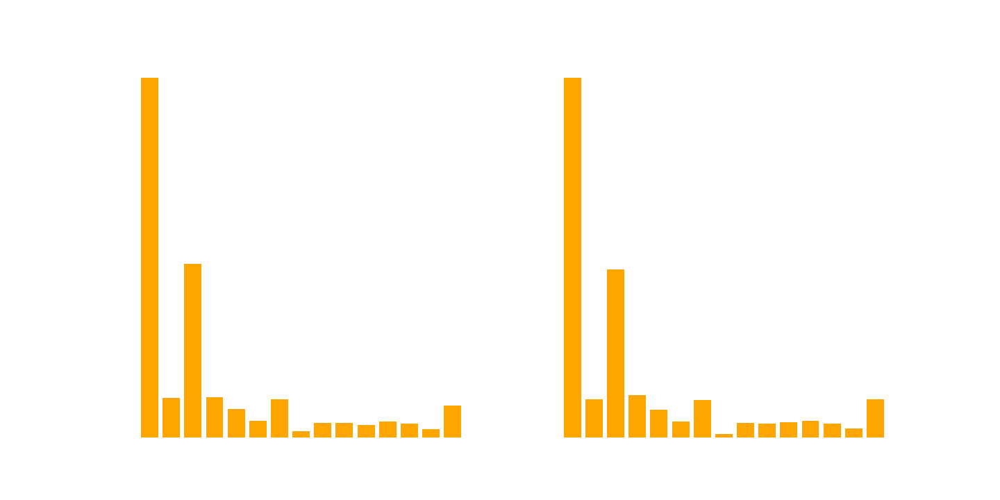

# Custom COCO dataset

Subset of the COCO `train2017` dataset focussed around traffic. In addition to the annotations from COCO we have refined the class `traffic light` (10) into the three classes `traffic_light_red` (92), `traffic_light_green` (93) and `traffic_light_na` (94). We provide these annotations in both the COCO format as well as prepared for using it with [`yolov5`](https://github.com/ultralytics/yolov5).

## Classes
There is a total of 11392 images in the training set which contain 82350 annotations, and 2848 (20510 annotations) in the validation set. The figure shows the distribution.

Here are the exact numbers.

| Class COCO     | Class yolo | Name              | Images train | Imags val  | Anns train | Anns val  | 
|:-------------   | :------: | :-----------------: | :----------: | :--------: | :--------: | --------: | 
|  1             |  0       |  person             | 6598        | 1685         |   34800    | 8559      |
|  2             |  1       |  bicycle            | 1485        |358           |  3430      | 849       |
|  3             |  2       |  car                | 4545        |  1109        |  18711     |  4479     |
|  4             |  3       |  motorcycle         |   1342      |  343         |    3492    | 898       |
|  6             |  4       |  bus                |    1691     |  422         |   2621     | 662       |
|  7             |  5       |  train              |  1203       |   281        |  1511      | 360       |
|  8             |  6       |  truck              |  2310       |  539         |  3707      |  903      |
|  11            |  7       |  fire hydrant       | 1081        |   280        |    1190    |  295      |
|  13            |  8       |  stop sign          |  1068       |    246       |  1216      | 283       |
|  17            |  9       |  cat                |  846        |   266        | 995        | 306       |
|  18            |  10      |  dog                | 1015        |    266       | 1268       | 331       |
|  92            |  11      |  traffic_light_red  | 1391        |     334      | 2511       | 620       | 
|  93            |  12      |  traffic_light_green|  856        |    202       |  1416      |  378      |
|  94            |  13      |  traffic_light_na   |  2390       |   637        | 5482       | 1587      |

From the original COCO traffic lights, we discarded 772 and 118 for train and validation respectively due to mislabelled or otherwise corrupt labels.

## How to use
1. Download the images `train2017` from the COCO [website]().

2. Under images, create two folders `trainTraffic` and `valTraffic`.

3. Run the script `copy_images`. This copies train and val images from `train2017` into the folders from 02. Afterwards you can delete `train2017`.

4. Download the annotations `instances_trainTraffic.json` and `instances_valTraffic` [here](https://drive.google.com/drive/folders/1P2k-BFuG8_vNdd95w-O183PLqSDhW6yR?usp=sharing) and put them into the annotations folder.

If you want to train a `yolov5` model, you can download the annotaions in the yolo format [here](https://drive.google.com/file/d/1ev2HgNixmHsR2r9n-g50VVW3HAYccUA9/view?usp=sharing).

## Files
01 - Select images with traffic lights and 12 other classes.

02 - Split the dataset from 01 into train and val (80/20 split)

03 - Relabel traffic lights

04 - Transform dataset into YOLO format

05 - Add remaing traffic light images from COCO

06 - Merge 05 into rest
